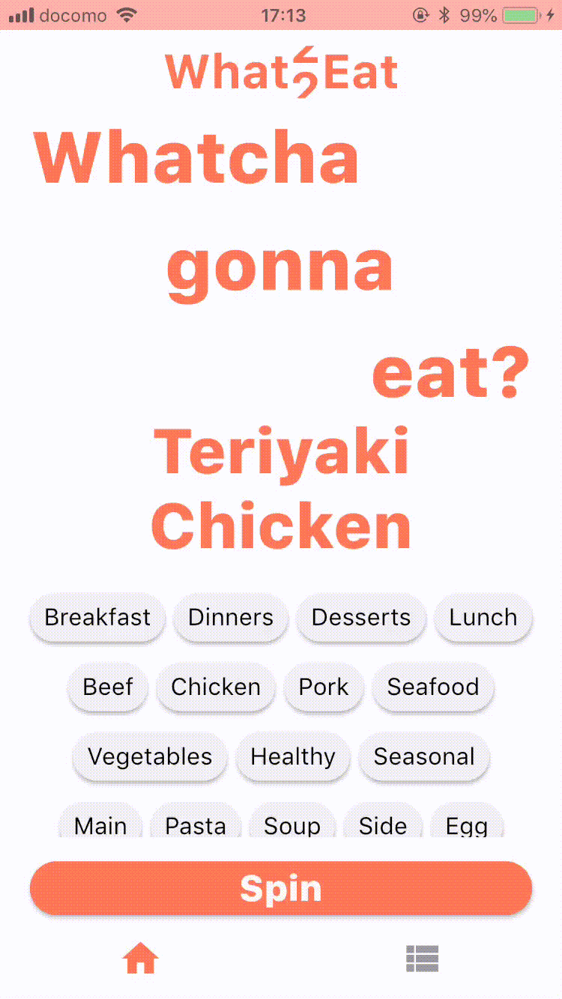
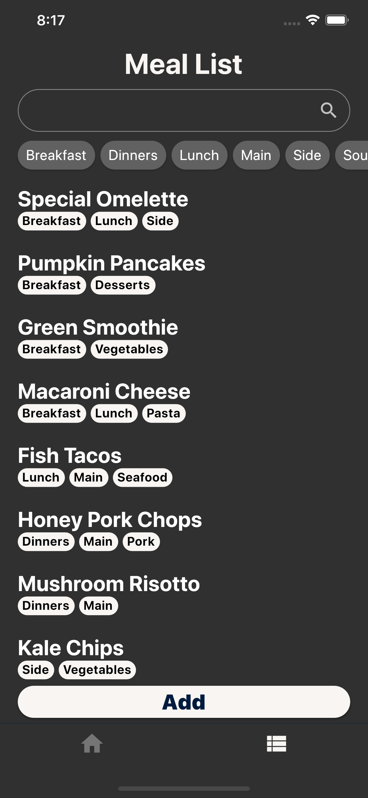
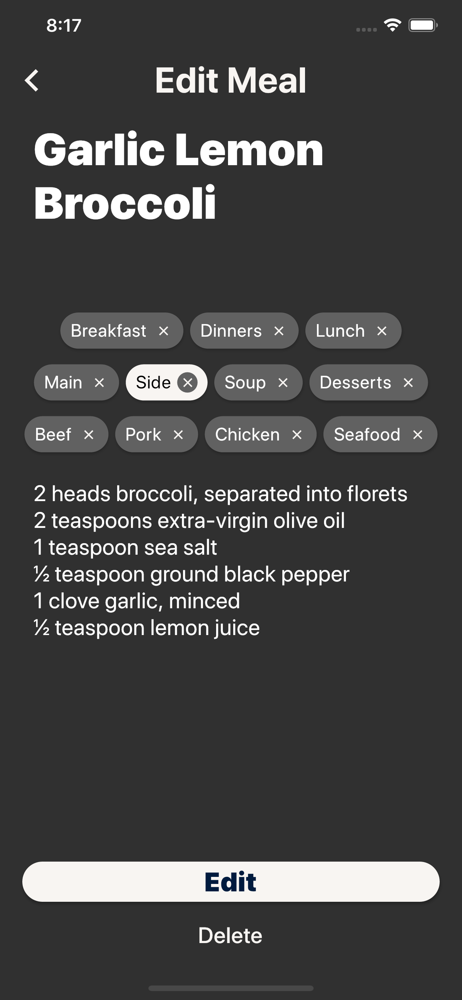
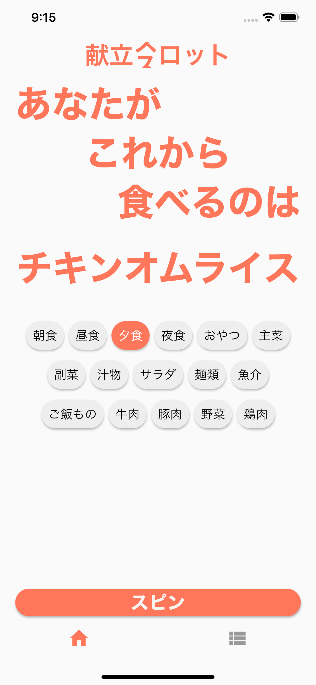
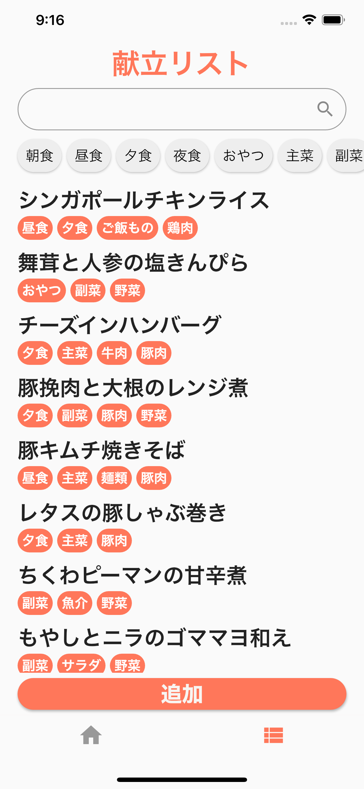
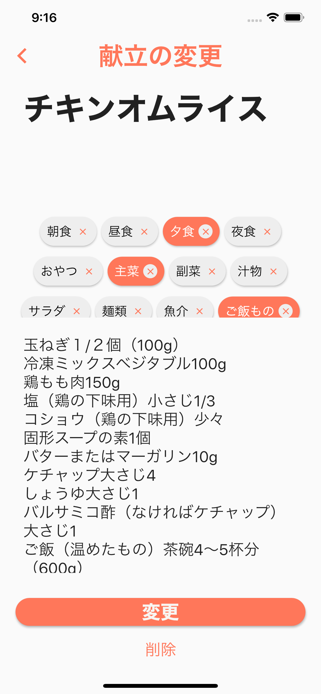
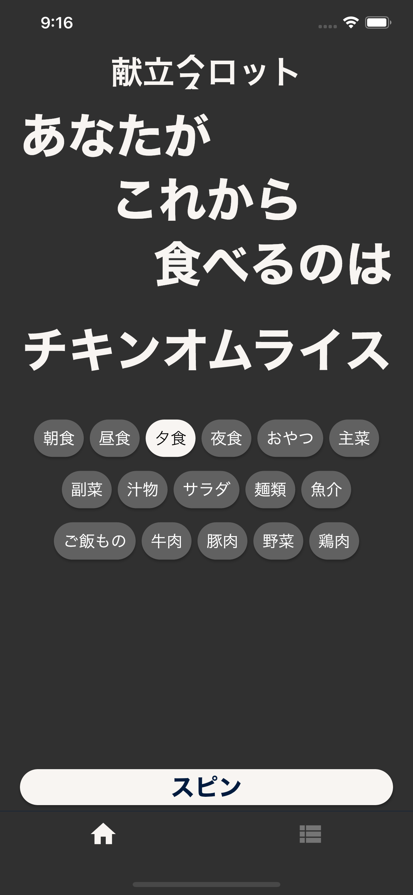
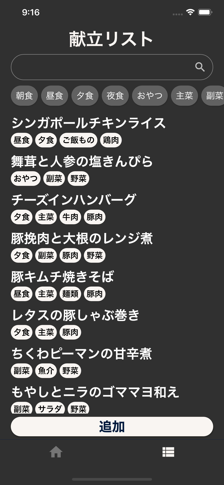
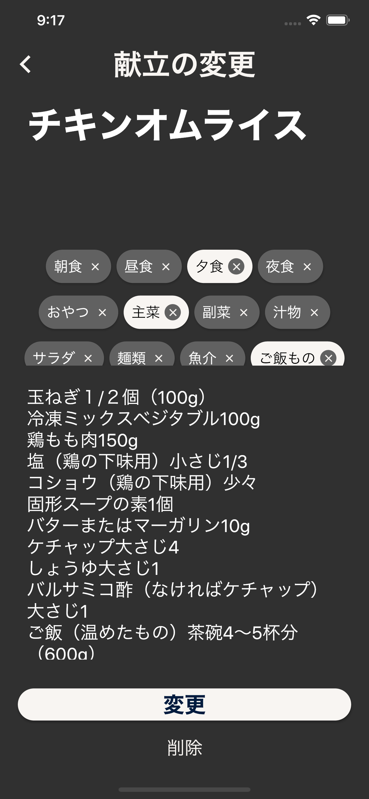

  

    
    <h1 align="center" style="font-size: 48px; font-weight: bold;">What2Eat 献立スロット</h1>
  

  <h2 align="center">A meal slot app build with Flutter
  </h2>
  

  Record your meal repertoire & Spin a slot to decide what to eat
  

  

    <a href="https://apps.apple.com/us/app/what2eat-spin-your-slot/id1502213961" target="_blank"></img></a>
  

  

    
  

  

    
  

---

## Screens

  

    
    
    
  

  

    
    
    
  

  

      
      
      
    

  

      
      
      
    

## Main Features

- Record a meal with tags and note
- Spin a slot with a list
- Filter with keywords and tags
- Light Theme & Dark Theme
- Localization(only Japanese)

## Main Stack

- Flutter
- Provider with Bloc like architecture
- Moor for locally persistent data

### About

This is a small personal project. Any comments and reactions would be awesome! There is a twin app called [What2Do](https://github.com/ykaito21/whattodo_app), and please check
[other projects](https://github.com/ykaito21/flutter_projects/blob/master/project_list.md) too.
